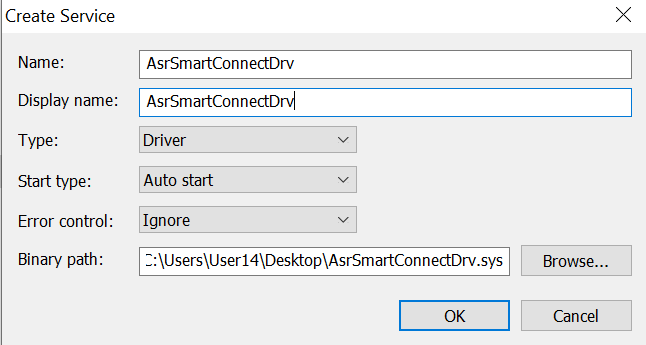

# Vulnerable windows driver

This is a Proof of Concept for the vulnerable driver AsrSmartConnectDrv.sys. Since this driver is using [RWEverything](https://rweverything.com/) we can use it to read/write physical memory and also read/write the [control registers](https://en.wikipedia.org/wiki/Control_register).

This is my first time reversing a vulnerable driver like this so the code and this report might not be the best but im trying :3 Thanks to everyone who at least saw this!

# How it works

This driver doesnt have any security measures so you can just do ioctl calls to it and let it do what you want.
So to utilize this we just need to send the right ioctl calls for example `0x22286C` to read a specified control register.
Unfortunatly I didnt find any read/write for virtual memory so to do that you would need to translate the physical memory to virtual to read or write to it.

# How to use

Start the AsrSmartConnectDrv.sys driver using Process Hacker modify the code to do what you want and run. Very simple!

# Useability

You could write a driver manual mapper with this or do some fun stuff like crashing your pc by writing 0 to the cr3 control register.